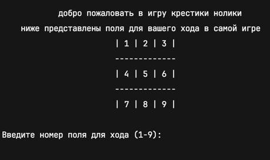

# 🎮 Крестики-нолики | Tic-Tac-Toe

Мой первый проект на Python | 

Простая консольная реализация классической игры "Крестики-нолики" с минимальным функционалом. 

Пример игры 

## 📝 Описание
Это мой первый учебный проект на Python, созданный в рамках изучения основ языка:
- Работа с функциями
- Условные операторы
- Циклы
- Работа с списками (игровое поле)
- Ввод/вывод в консоль

